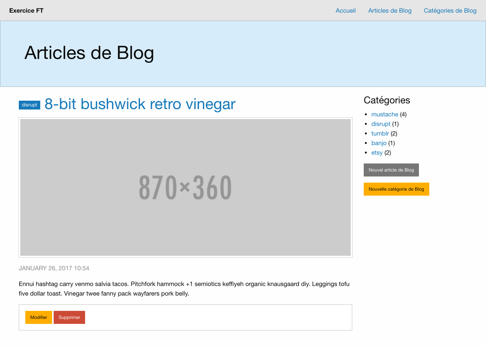
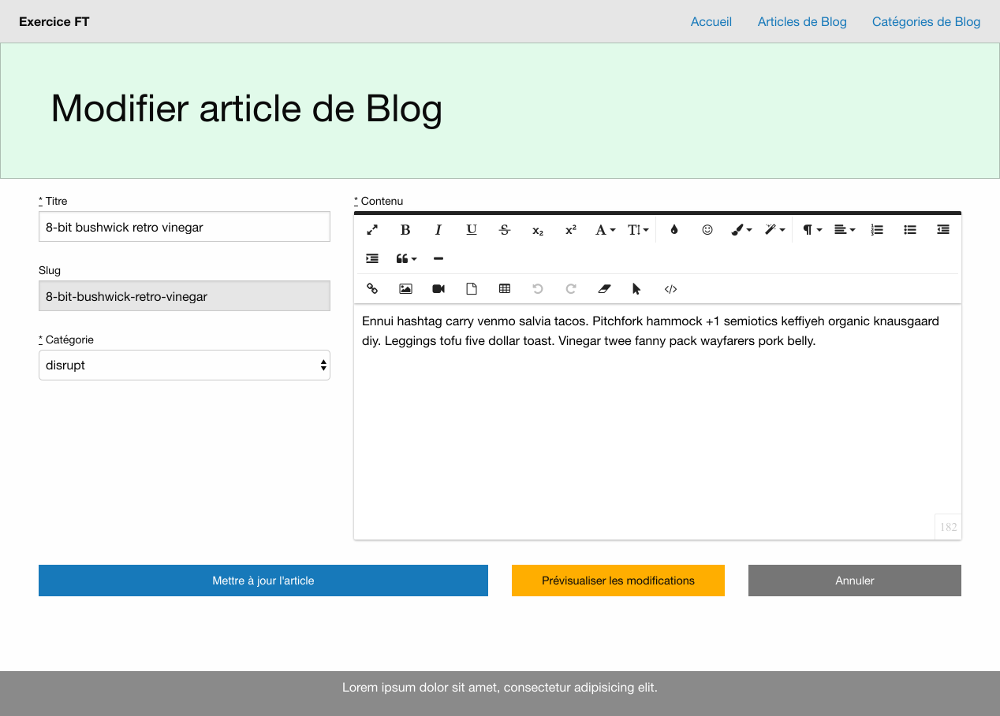

# BlogMVC
Rails 5 Blog MVC project

<table>
  <tr>
    <td>Build Status</td>
    <td>
      
    </td>
    <td>Dependencies</td>
    <td>
      
    </td>
  </tr>
  <tr>
    <td>Code Quality</td>
    <td>
      
      
    </td>
    <td>Code Coverage</td>
    <td>
      
      
    </td>
  </tr>
  <tr>
    <td>Issue Stats</td>
    <td colspan="2">
      
      
    </td>
    <td>
      
      
    </td>
  </tr>
</table>

## Etapes
- Executer `rails db:seed` pour créer des catégories et des articles
- Executer `rails server`
- Executer `rspec`

## Technologies
- jQuery
- Foundation (style, modale et carrousel)
- Slim
- Froala WYSIWYG editor (contenu formattable)
- Kaminari

### Base de données
- SQlite 3

#### Tests
- RSpec
- FactoryGirl
- Shoulda

## Screenshots
#### Page blogs

#### Edition d'un article

